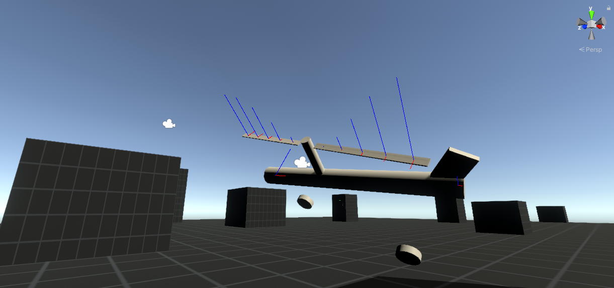
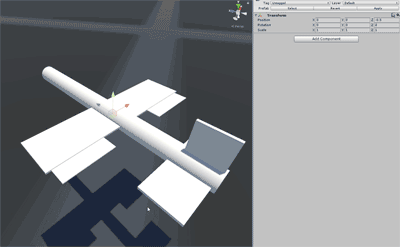
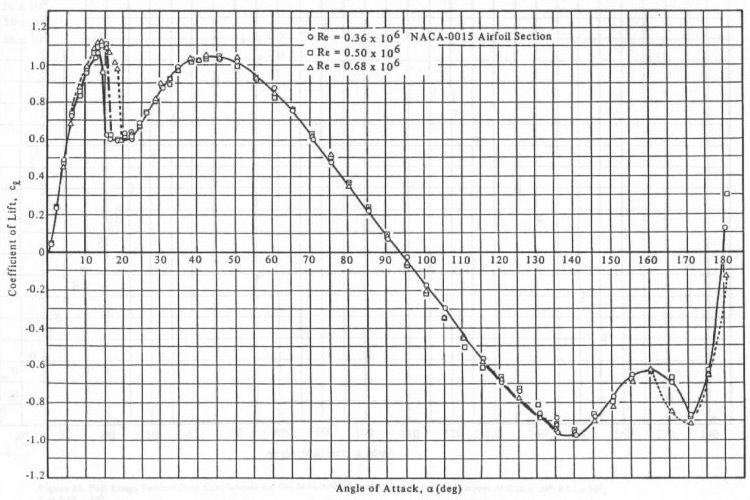
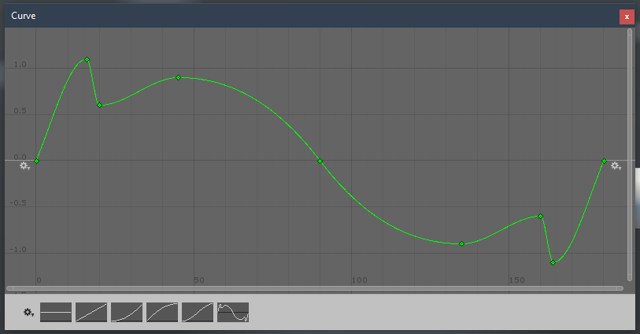
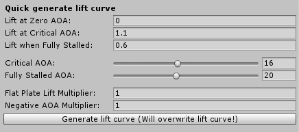

# SimpleRotors

_Based on SimpleWings: https://github.com/brihernandez/simplewings_

A simple, configurable aerodynamic rotor blade that applies lift and drag forces based on pre-defined curves. Includes a flyable example helicopter complete with a simulated swashplate for cyclic and collective control.

The following real-world helicopter concepts are fully simulated:
- Relative wind
- Gyroscopic precession
- Torque/Anti-torque
- Dissymmetry of lift
- Retreating blade stall

Built in **Unity 20.2.0a21**

## Download

You can either clone the repository or [download the asset package](./SimpleRotors.unitypackage) located in the root.

If you'd like to try the standalone demo, [it can be downloaded from the releases page](https://github.com/mmiller84/SimpleRotors/releases).

***Note:** When importing the demo content from the package, "Yaw" and "Collective" axes will need to be set up in the Input Manager in order to get the tail rotor and collective pitch to work on the sample helicopter. This is because asset packages cannot modify the Input Manager, and the helicopter requires a third and fourth axis not available on the default setup.*

## Demo Controls

The demo helicopter is best flown with an Xbox One controller.

### Gamepad

- Left stick: Cyclic (pitch and roll)
- Right stick: Collective
- Triggers: Tail Rotor (Yaw)
- Spacebar: Engine on/off

# Rotor Blades

The rotor blades are driven through a very abstract approximation of aerodynamics. Lift and drag coefficients are simulated through pre-defined curves created on a WingCurve ScriptableObject. As the angle of attack changes, so does the lift and drag forces incurred. Lift is always perpendicular to the air flow, while drag is always in the opposite direction of the velocity.

## SimpleWing Component

Both a WingCurve and Rigidbody are **requred**. The Rigidbody preferably should be on a parent gameobject that represents the object using the wings. The Rigidbody can be assigned manually through script, but it also automatically uses "GetComponentInParent" during its Awake to try and find one.

- Dimensions: The dimensions of the wing. The bigger the wing, more the lift (and drag) it applies. A white outline is displayed of the dimensions of the wing.

- Apply Forces at Center: When true, the wing will apply lift and drag at the center of mass. For certain wings, such as something that might be representing the inherent lift of a fuselage, it may be desirable for all wing forces to not impart a torque on the rigidbody.

- Wing: The wing curve. Required for the wing to function. See Wing Curve section below for more details.

- Lift/Drag multiplier: The wings are currently scaled to work with realistic weights and sizes. In these cases, values close to 1 are "realistic", but these values allow tweaks as necessary.

## Wing Curves

Wing Curves can be created by right clicking in the Project window and selecting Create -> Wing Curve. They are required for wing operation, and represent the "flight model." These can be arbitrarily tweaked, but two example curves have been given that should be useful for most cases.

The Standard Wing is based on [experimental data on the NACA 0015 airfoil](http://www.aerospaceweb.org/question/airfoils/q0150b.shtml). It's a symmetrical wing, so it doesn't generate lift at zero angle of attack. However, because it's still a wing, it is very responsive to angle of attack and creates lift easily with minimal angles of attack. It will however stall at around 16 degrees and lift will drop dramatically. This wing is designed to be used by the main wing(s) on a plane.

The flat plate wing is what it sounds like and is a good approximation for control surfaces or fins on a missile. They produce lift, but that's only because they have an angle of attack and the wind beneath it is pushing it upwards. These don't really stall, but they don't really produce much lift unless they're deflecting pretty hard.

The Lifting wing is a high lift wing that generates lift even at 0 degrees angle of attack, but stalls easily. It's based loosely on the [NACA 2408 wing](http://airfoiltools.com/airfoil/details?airfoil=naca2408-il#polars).

### Creating Wing Curves

When creating wings, the most important points are the first and last three. These are the ones that most often are directly available in any kind of lift coefficient vs alpha graph, and the ones that you will most often be adjusting. Most CL graphs will stop a little after the stalling point, at which point air flow becomes unpredictable. Eventually, most wings start to follow the lift curves of a generic flat plate. This is represented by the middle three points in the default graph and does not usually need to be adjusted.

To aid in creating wings, a lift curve generator is available. With it, you can specify the basic parameters of the curve such as where the critical angle of attack is, and how much lift the wing generates at this point. Tooltips are available on each option.

# Changelog

### 1.0 (October 25, 2020)
- Initial release
- Forked from SimpleWings (https://github.com/brihernandez/simplewings)
